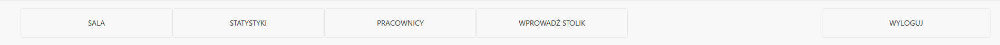
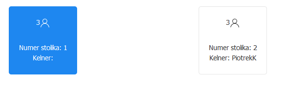

# Restaurant Assistant - Instrukcja obsługi
 

## Opis widoków
 
 

* Widok Logowania

Zawiera nagłównek z nazwą aplikacji, pola do wpisania login-u oraz hasła oraz przycisk do zatwierdzenia i w przypadkku powodzenia przejścia do następnego okna.
W przypadku podania błędnych danych wyświetlony zostanie komunikat z informacją o błędzie.
 
 

* Widok przejściowy

Zawiera nagłówek, informację na jakim koncie został zalogowany użytkownik i jaki ma poziom uprawnień, oraz przycisk przekierowujący do następnego okna.
 
 

### W zależności od poziomu prawnień (ADMIN, CHEF, WAITER) użytkownik zostaje przekierowany do odpowiedniej sekcji:
 
 

* Widok górnego menu

Jest to element wspólny dla wszystkich użytkowników. Zawiera logo aplikacji, login użtkownika, poziom uprawnień podany w nawiasach, oraz przycisk umożliwiający schowanie dolnego menu.
 
 
 

## Sekcja ADMIN
 
 

* Widok dolnego menu

Zawiera cztery przyciski (SALA, STATYSTYKI, PRACOWNICY, WPROWADŹ STOLIK) do zmiany widoków ekranu głównego oraz przycisk WYLOGUJ.
 
 

* Widok stolików (przycisk WPROWADŹ STOLIK)

Umożliwia wprowadzenie stolików. Zawiera pola takie jak numer stolika, ilość miejsc przy danych stoliku, oraz przycisk DODAJ.
Po dodaniu stolika jest on wyświetlony powyżej wraz z przyciskiem usuń stolik. Nie jest możliwe usunięcie stolika, który jest w trakcie zamówienia. Numery stolików muszą być unikatowe o z góry ustalonych wartościach.
 
 

* Widok dostępnych pracowników (przycisk PRACOWNICY)

Umożliwia dodanie użytkowników. Przy pierwszym uruchomieniu aplikacji widoczne jest tylko domyślne konto użytkownika "ADMIN".

Zawiera pola do wprowadzenia login-u, hasła, imienia, nazwiska, pole wyboru stanowiska oraz przycisk WPROWADŹ.
Login musi być unikatowy względem tych, które istnieją bądź istniały w bazie. Istnieją dodatkowe wymagania odnośnie loginu, hasła. Stanowisko musi być wybrane. O błędnym wprowadzeniu danych informują stosowne komunikaty. Pola Imię oraz Nazwisko nie są wymagane. Po wprowadzeniu użytkownika jest on wyświetlany w liście powyżej. Istnieje możliwość usunięcia konta danego użytkownika klikająć przy nim przycisk USUŃ KONTO. Nie można usunąć użytkownika o uprawnieniach WAITER, który aktualnie obsługuje stolik. Nie można usunąć konta, na którym obecnie użytkownik jest zalogowany. Istnieje możliwość zmiany hasła danego użytkownika . Po kliknięciu przy użytkowniku na przycisk ZMIEŃ HASŁO następuje przekierowanie do osobnego widoku.
 
 

* Widok zmiany hasła

Zawiera pole do wpisania hasła i przycisk do zatwierdzenia. Po zatwierdzeniu następuje przekierowanie do widoku dostępnych pracowników. W przypadku rezygnacji należy wcisnąć dowolny przycisk w menu dolnym.
 
 

* Widok główny: sala + dostępni pracownicy (przycisk SALA)

Składa się z sekcji bocznej umieszczonej po prawej stronie, która zawiera panel delegowania zadania oraz listę dostępnych użytkowników oraz z sekcji głównej, która przedstawia listę dostępnych stolików, które wcześniej zostały wprowadzone.

Sekcja główna przedstawia stoliki. Blok stolika wyświetla informację na temat ilości miejsc, numer stolika i login kelnera, który dany stolik aktualnie obsługuje. Stolik wolny ma kolor niebieski, natomiast stolik zajęty kolor biały. Stolik wybieramy klikając na niego. Nie można wybrać zajętego stolika.

Sekcja boczna wyświetla listę kelnerów (uprawnienia WAITER), którzy są aktualnie zalogowani. Blok kelnera przekazuje informacje takie jak login, numery aktualnie obsługiwanych stolików przez danego kelnera, oraz zawiera też przycisk WYBIERZ KELNERA.
Panel delegowania zadania zawiera pole wyświetlające informację takie jak numer wybranego stolika oraz login wybranego kelnera. Delegowanie kelnera polega na kliknięciu na dostępny stolik, kliknięciu na przycisk WYBIERZ KELNERA, a następnie na przycisk Deleguj zadanie. Stolik staje się niedostępny, a przy kelnerze wyświetlona jest informacja, że obsługuje wybrany stolik.
 
 

* Widok statystyk (przycisk STATYSTYKI)

Zawiera sekcje dotyczące kelnerów oraz dań. W sekcji Kelnerzy wyświetlona jest lista kelnerów. Po podaniu w polach DATA od oraz DATA do odpowiednich danych oraz kliknięciu w przycisk Pokaż wyświetlona zostaje informacja o ilości przyjętych zamówień przez danego kelnera w danym przedziale czasu.
W sekcji Dania wyświetlona jest lista dań z menu. Po podaniu w polach DATA od oraz DATA do odpowiednich danych praz kliknięciu w przycisk Pokaż wyświetlona zostaje ilość wydanych dań dla każdej pozycji w danym przedziale czasu.
Nie są brane pod uwagę dania usunięte z menu oraz kelnerzy którzy nie figurują już na liście.
 
 
 

## Sekcja CHEF
 
 

* Widok dolnego menu

Zawiera dwa przyciski (WPROWADŹ MENU, oraz ZAMÓWIENIA) do zmiany widoków ekranu głównego oraz przycisk WYLOGUJ.
 
 

* Widok menu (przycisk WPROWADŹ MENU)

Zawiera pola do wprowadzenia nazwy, ceny, pole wyboru statusu oraz przycisk WPROWADŹ. Pola Nazwa i Cena są wymagane. Status domyślnie ustawiony jest na DOSTĘPNY. Wprowadzona pozycja zostaje wyświetlona na liście powyżej. Pozycję można chwilowo dezaktywować - przycisk DOSTĘPNY. Wtedy jest ona widoczna w menu, ale nie ma możliwości jej wyboru. W dowolnej chwili pozycję można na powrót aktywować - przycisk BRAK. Możliwe jest całkowite usunięcie pozycji z Menu - przycisk USUŃ.
 
 

* Widok zamówienia (przycisk ZAMÓWIENIA)

Zawiera listę aktualnie przyjętych zamówień, które czekają na realizację w kuchni przedstawiającą nazwę dania, cenę, kelnera, który przyjął zamówienie oraz godzinę przyjęcia. Przycisk GOTOWE potwierdza, że danie jest gotowe do odbioru. Po kliknięciu pozycja znika z listy.
 
 
 

## Sekcja WAITER
 
 

* Widok dolnego menu

Zawiera przycisk ODBIERZ do zmiany widoku ekranu głównego oraz przycisk WYLOGUJ.
 
 

* Widok główny

Domyślnie po lewej zawiera listę aktualnie obsługiwanych stolików. Blok stolika zawiera informację o ilości miejsc oraz numer stolika. Stolik który został obsłużony ma kolor niebieski, stolik którego zawartość jest aktualnie wyświetlana ma kolor czarny, nowy stolik który nie został jeszcze obsłużony ma kolor czerwony. Po kliknięciu na dany stolik uznaje się go za obsłużony i następuje zmiana koloru. Stolik z kolorem czarnym ma dodatkowo ikonę obok informacji na temat ilości miejsc. Po kliknięciu na nią następuje zwolnienie stolika. Nie jest możliwe zwolnienie stolika, który zawiera aktywne zamówienia. 
Po kliknięciu na dany stolik po lewej zostaje wyświetlone dostępne menu wprowadzone przez szefa kuchni. Przycisk DODAJ przy danej pozycji jest aktywny bądź nie w zależności od statusu danej potrawy. Po kliknięciu na niego dla danego stolika zostaje wygenerowane zamówienie, które zostaje wyświetlone na liście powyżej. Zamówienie to zostaje przekazane do kuchni, a tutaj może posiadać statusy KITCHEN (w przygotowaniu w kuchni), READY (gotowe do odbioru), RELEASED (wydane klientowi).
Ilość przyjętych zamówień dla danego stolika jest dowolna. W momencie, gdy danie zostało wydane klientowi po dopełnieniu formalności należy kliknąć w przycisk ZMIEŃ STATUS przy danej pozycji. Wtedy zamówienie znika z listy i zostaje zarchiwizowane na potrzeby statystyk. Możliwe jest wtedy zwolnienie stolika.
 
 

* Widok zamówień (ODBIERZ)

Po lewej tak samo wyświetlana jest lista dostępnych stolików, po prawej lista aktywnych zamówień przyjętych przez danego kelnera dla danych stolików, które obsługuje. Podane są informacje takie jak nazwa dania, cena, status, godzina przyjęcia, oraz numer stolika. Po przyjęciu zamówienia przez kelnera zamówienie pojawia się na tej liście ze statusem KITCHEN. Jeśli danie jest gotowe do odbioru z kuchni status zmienia się na READY. Po wydaniu dania klientowi kelner klika w przycisk ZMIEŃ STATUS. Wtedy zamówienie znika z tej listy, ale nie z indywidualnej listy pojedynczego stolika. 

